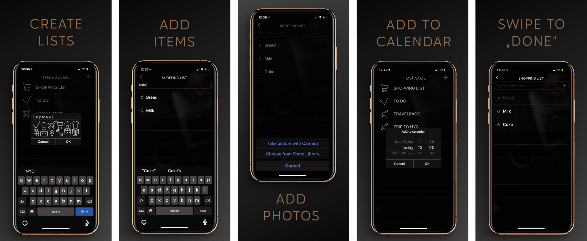
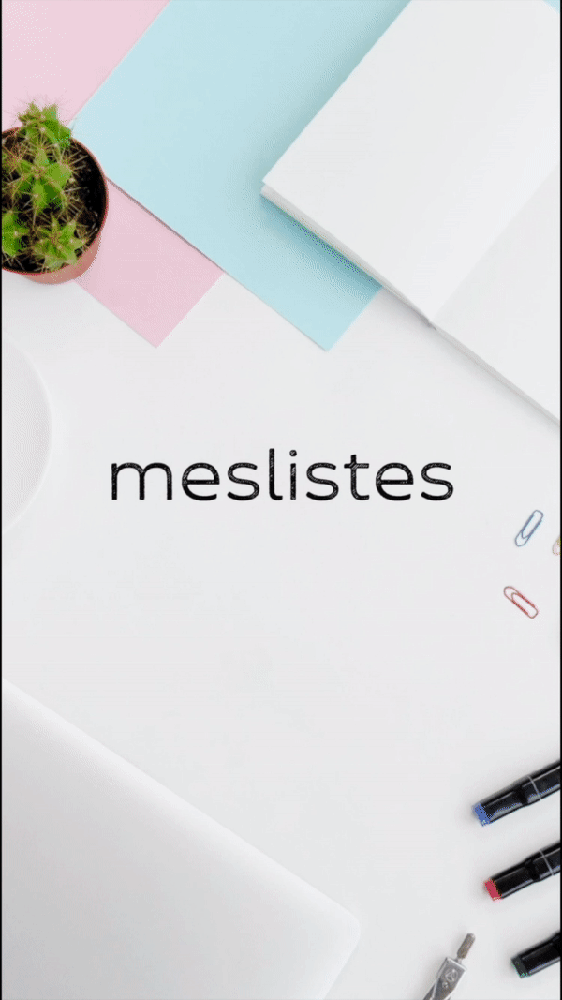

# meslistes

MESLISTES est plus qu'une simple to-do list, c’est une application indispensable pour celles et ceux qui ont du mal à rester organisés. 
On peut y créer plusieurs listes : les courses, les choses à faire, les films à regarder, les lieux à visiter ou encore les choses à 
ne pas oublier quand on part en voyage. 
On peut également prendre des photos d’objets et les ajouter à sa liste. 
Il n’est pas nécessaire d'être un pro du smartphone pour utiliser cette application, elle très intuitive et facile à utiliser.

**Lien :**
[Télécharger l'application sur l'App Store](https://apps.apple.com/us/app/meslistes-a-checklist-app/id1458475140?ign-mpt=uo%3D2)

**Aperçu :**
***Dark Mode***

***Light Mode***

